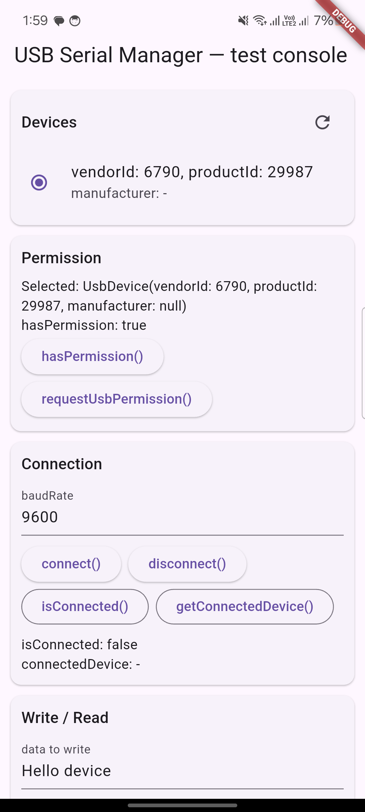
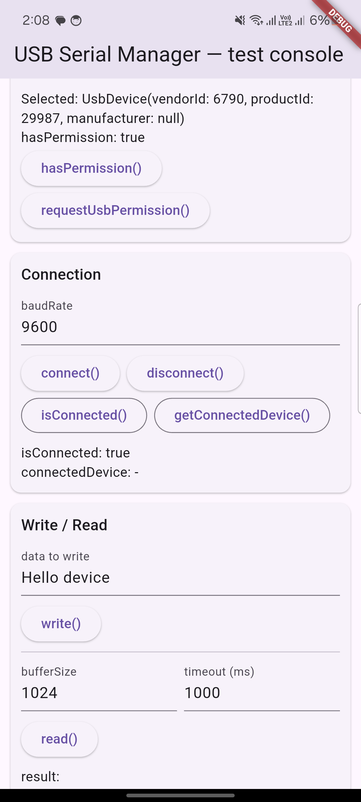
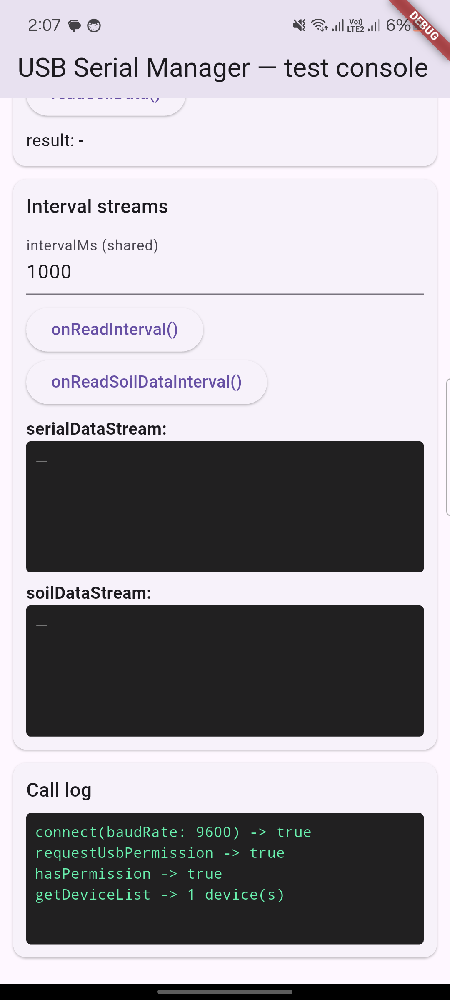

# flutter_usb_serial_manager

[](https://pub.dev/packages/flutter_usb_serial_manager)
[](#supported-platforms)
[](https://pub.dev/packages/flutter_lints)
[](LICENSE)

> 🤖 **Android only.** This plugin wraps Android's native USB Host API and does not support iOS, web, or desktop — see [Supported platforms](#supported-platforms).

**flutter_usb_serial_manager** is a Flutter plugin for **USB serial communication on Android** — list connected USB devices, request USB host permission, open a serial connection at any baud rate, and read or write raw bytes over USB OTG. It also ships a built-in **Modbus RTU soil-sensor helper** (one-shot reads and live interval streams) for agriculture / IoT projects that talk to NPK, temperature, humidity, EC, salinity and pH probes over USB-to-RS485.

Whether you're building a USB serial terminal, a Modbus RTU sensor dashboard, a barcode/RFID reader integration, or any Android app that needs low-level **USB-to-serial (CDC/FTDI/CH34x/CP210x)** communication, this plugin gives you a small, typed, stream-friendly Dart API on top of native Android USB Host APIs.

---

## Table of contents

- [Features](#features)
- [Supported platforms](#supported-platforms)
- [Screenshots](#screenshots)
- [Getting started](#getting-started)
  - [1. Add the dependency](#1-add-the-dependency)
  - [2. Android setup (required)](#2-android-setup-required)
  - [3. iOS](#3-ios)
- [Usage](#usage)
  - [List devices & connect](#list-devices--connect)
  - [Write and read raw bytes](#write-and-read-raw-bytes)
  - [Modbus soil-sensor helper](#modbus-soil-sensor-helper)
  - [Live raw serial stream](#live-raw-serial-stream)
- [API reference](#api-reference)
- [Example app](#example-app)
- [Troubleshooting / FAQ](#troubleshooting--faq)
- [Roadmap](#roadmap)
- [Releasing](#releasing)
- [Contributing](#contributing)
- [License](#license)
- [Credits](#credits)

---

## Features

- 🔌 **Device discovery** — enumerate every USB device currently attached via USB OTG.
- 🔐 **Permission handling** — check and request Android's runtime USB permission dialog.
- 🔗 **Connect/disconnect** — open a serial connection to any device at a custom baud rate.
- 📤📥 **Raw read & write** — send and receive raw bytes over the serial connection.
- 🌱 **Modbus RTU soil-sensor helper** — one call to read temperature, humidity, EC, salinity, NPK and pH from a standard Modbus soil sensor, no manual frame-building required.
- 📡 **Live data streams** — subscribe to a `Stream` for interval-based raw reads or soil-sensor samples instead of polling.
- 🧩 **Typed Dart models** — `UsbDevice`, `RawReadConfig`, `SoilSensorConfig` with sane defaults and IDE autocompletion.
- 🪶 **Small surface area** — a focused API instead of a heavyweight framework, easy to wrap in your own repository/BLoC layer.

## Supported platforms

| Platform | Support | Notes |
|---|---|---|
| Android | ✅ API 24+ | Uses Android's [USB Host API](https://developer.android.com/develop/connectivity/usb/host) — device must support USB OTG. |
| iOS | ❌ Not supported | iOS does not expose generic USB-host/serial access to third-party apps without Apple's MFi program. Not currently planned. |
| Web / Desktop | ❌ Not supported | Out of scope for this plugin. |

## Screenshots

The example app included in this repo is a full "test console" that exercises every method in the plugin — device discovery, permissions, connection, raw read/write, Modbus soil-sensor reads, and live streams.

<table>
  <tr>
    <td align="center" width="33%">
      
      <br/><sub>Device discovery &amp; permission</sub>
    </td>
    <td align="center" width="33%">
      
      <br/><sub>Connect, write &amp; read</sub>
    </td>
    <td align="center" width="33%">
      
      <br/><sub>Live Modbus soil-sensor stream</sub>
    </td>
  </tr>
</table>

## Getting started

### 1. Add the dependency

```yaml
dependencies:
  flutter_usb_serial_manager: ^0.0.1
```

Then fetch it:

```sh
flutter pub get
```

### 2. Android setup (required)

This plugin talks to Android's USB Host API, so a couple of one-time additions are needed in **your app's** `android/app/src/main/AndroidManifest.xml` (not the plugin's).

1. **Declare the USB host feature** — add this as a direct child of `<manifest>`:

   ```xml
   <uses-feature android:name="android.hardware.usb.host" android:required="false" />
   ```

   `required="false"` keeps your app installable on devices without USB host support; only devices that actually plug in a USB accessory will exercise this plugin.

2. **(Optional, recommended) Auto-launch on device attach.** Add an intent filter to your launcher `<activity>` so Android offers to open your app the moment a USB device is plugged in, instead of requiring the user to open it first:

   ```xml
   <activity
       android:name=".MainActivity"
       ...>
       <!-- your existing intent-filters -->

       <intent-filter>
           <action android:name="android.hardware.usb.action.USB_DEVICE_ATTACHED" />
       </intent-filter>
       <meta-data
           android:name="android.hardware.usb.action.USB_DEVICE_ATTACHED"
           android:resource="@xml/device_filter" />
   </activity>
   ```

   and create `android/app/src/main/res/xml/device_filter.xml`:

   ```xml
   <?xml version="1.0" encoding="utf-8"?>
   <resources>
       <usb-device />
   </resources>
   ```

   An empty `<usb-device />` matches every USB device, which is convenient for development. For production, narrow it down to your target hardware's `vendor-id`/`product-id` (you can read these from [`UsbDevice.vendorId`](#api-reference) via `getDeviceList()`).

3. **Minimum SDK.** Make sure `minSdkVersion` (`minSdk` in `android/app/build.gradle.kts`) is **24** or higher.

> **Note on native dependency resolution:** this plugin depends on a native Android library published on [JitPack](https://jitpack.io), and already declares that repository for its own build. If your app centralizes repositories with `dependencyResolutionManagement { repositoriesMode.set(RepositoriesMode.FAIL_ON_PROJECT_REPOS) }` in `android/settings.gradle.kts`, add `maven { url = uri("https://jitpack.io") }` there as well so Gradle is allowed to resolve it.

### 3. iOS

Not supported — see [Supported platforms](#supported-platforms). Calling any method on iOS will throw a `MissingPluginException`.

## Usage

Import the package:

```dart
import 'package:flutter_usb_serial_manager/flutter_usb_serial_manager.dart';
import 'package:flutter_usb_serial_manager/modals/usb_device.dart';
import 'package:flutter_usb_serial_manager/modals/raw_read_config.dart';
import 'package:flutter_usb_serial_manager/modals/soil_sensor_config.dart';

final usb = FlutterUsbSerialManager();
```

### List devices & connect

```dart
// 1. Discover attached USB devices.
final devices = await usb.getDeviceList();
final device = devices.first;

// 2. Ask the user for permission (shows Android's system dialog).
final granted = await usb.requestUsbPermission(device);
if (!granted) return;

// 3. Open the serial connection.
final connected = await usb.connect(device, baudRate: 9600);
print('Connected: $connected');
```

### Write and read raw bytes

```dart
await usb.write('Hello device');

final response = await usb.read(
  config: const RawReadConfig(bufferSize: 1024, timeout: 1000),
);
print('Received: $response');
```

> Raw `write`/`read` only make sense for devices that understand plain bytes you send them (e.g. a microcontroller echoing text). Modbus RTU devices — like the soil sensor helper below — expect a specific binary frame, so use `readSoilData` for those instead.

### Modbus soil-sensor helper

One-shot read:

```dart
final sample = await usb.readSoilData(
  config: const SoilSensorConfig(
    slaveId: 1,
    startAddress: 0x0000,
    registerCount: 8,
    responseDelayMs: 300,
  ),
);

print(sample);
// {temperatureC: 24.3, humidityPercent: 41.0, ecUsCm: 210.0,
//  salinityMgL: 120.0, nitrogenMgKg: 30.0, phosphorusMgKg: 12.0,
//  potassiumMgKg: 18.0, ph: 6.8}
```

Continuous stream:

```dart
await usb.onReadSoilDataInterval(intervalMs: 1000);

final subscription = usb.soilDataStream.listen((sample) {
  print('Soil sample: $sample');
});

// later
await usb.offReadSoilDataInterval();
await subscription.cancel();
```

### Live raw serial stream

```dart
await usb.onReadInterval(
  config: const RawReadConfig(bufferSize: 1024, timeout: 1000),
  intervalMs: 500,
);

final subscription = usb.serialDataStream.listen((chunk) {
  print('Serial chunk: $chunk');
});

// later
await usb.offReadInterval();
await subscription.cancel();
```

Always call `disconnect()` when you're done:

```dart
await usb.disconnect();
```

## API reference

### `FlutterUsbSerialManager`

| Method | Returns | Description |
|---|---|---|
| `getDeviceList()` | `Future<List<UsbDevice>>` | Lists USB devices currently attached to the host. |
| `hasPermission(UsbDevice device)` | `Future<bool>` | Whether the app already has permission to access `device`. |
| `requestUsbPermission(UsbDevice device)` | `Future<bool>` | Shows the Android USB-permission dialog and resolves with the user's decision. |
| `connect(UsbDevice device, {int baudRate = 9600})` | `Future<bool>` | Opens a serial connection to `device`. |
| `isConnected()` | `Future<bool>` | Whether a device is currently connected. |
| `getConnectedDevice()` | `Future<UsbDevice?>` | The currently connected device, or `null`. |
| `disconnect()` | `Future<void>` | Closes the current serial connection. |
| `write(String data)` | `Future<void>` | Writes `data` to the connected device. |
| `read({RawReadConfig config})` | `Future<String>` | Reads raw bytes once, according to `config`. |
| `readSoilData({SoilSensorConfig config})` | `Future<Map<String, double>?>` | Reads one Modbus soil-sensor sample. |
| `onReadInterval({RawReadConfig config, int intervalMs = 1000})` | `Future<void>` | Starts pushing raw reads to `serialDataStream` every `intervalMs`. |
| `offReadInterval()` | `Future<void>` | Stops the interval started by `onReadInterval`. |
| `onReadSoilDataInterval({SoilSensorConfig config, int intervalMs = 1000})` | `Future<void>` | Starts pushing soil-sensor samples to `soilDataStream` every `intervalMs`. |
| `offReadSoilDataInterval()` | `Future<void>` | Stops the interval started by `onReadSoilDataInterval`. |
| `serialDataStream` | `Stream<String>` | Raw bytes pushed while an `onReadInterval` is active. |
| `soilDataStream` | `Stream<Map<String, double>>` | Soil samples pushed while an `onReadSoilDataInterval` is active. |

### Models

**`UsbDevice`**

| Field | Type | Description |
|---|---|---|
| `vendorId` | `int` | USB vendor ID. |
| `productId` | `int` | USB product ID. |
| `manufacturer` | `String?` | Manufacturer name, when the OS can report it. |

**`RawReadConfig`** — mirrors the native `RawReadConfig`.

| Field | Type | Default | Description |
|---|---|---|---|
| `bufferSize` | `int` | `1024` | Max bytes to read per call. |
| `timeout` | `int` | `1000` | Read timeout, in milliseconds. |

**`SoilSensorConfig`** — mirrors the native `SoilSensorConfig`, for standard Modbus RTU soil sensors.

| Field | Type | Default | Description |
|---|---|---|---|
| `slaveId` | `int` | `1` | Modbus slave/unit address. |
| `startAddress` | `int` | `0x0000` | First register to read. |
| `registerCount` | `int` | `8` | Number of registers to read. |
| `responseDelayMs` | `int` | `300` | Delay to wait for the sensor's response. |

## Example app

The [`example/`](example) directory contains a runnable Flutter app that doubles as a manual test console for every method above — device list, permission flow, connect/disconnect, write/read, Modbus soil-sensor reads, and both live streams with a scrolling log. It's the fastest way to verify your hardware works before wiring the plugin into your own UI.

```sh
cd example
flutter run
```

## Troubleshooting / FAQ

**`hasPermission()` / `connect()` always fails with `DEVICE_NOT_FOUND`.**
Make sure you're passing back a `UsbDevice` you got from `getDeviceList()` in the same session — device identity is matched by `vendorId`/`productId` against the currently attached devices.

**The USB permission dialog never appears.**
Confirm `android.hardware.usb.host` is declared and that the device is actually connected in USB host/OTG mode (some cables/adapters are charge-only). Also check `hasPermission()` first — if permission was already granted previously, no dialog is shown.

**`read()` / `write()` don't seem to do anything.**
Raw `read`/`write` only work with devices that understand plain bytes you send them. A Modbus RTU sensor won't respond to arbitrary text — use `readSoilData()` / `onReadSoilDataInterval()` instead, which build the correct Modbus frame internally.

**Gradle can't resolve the native dependency.**
See the [Android setup](#2-android-setup-required) note about JitPack and `dependencyResolutionManagement`.

## Roadmap

- [ ] Configurable Modbus function codes beyond the built-in soil-sensor profile.
- [ ] Parity/stop-bit/data-bit configuration for `connect()`.
- [ ] Unit tests for the platform channel layer.

iOS support is not on the roadmap — see [Supported platforms](#supported-platforms) for why.

## Releasing

Releases are automated with two GitHub Actions workflows:

1. **[`tag-release.yml`](.github/workflows/tag-release.yml)** — triggers whenever `version:` in `pubspec.yaml` changes on `main`. It creates the matching `vX.Y.Z` git tag and a GitHub Release, using the matching `CHANGELOG.md` section plus GitHub's auto-generated commit/PR notes as the release body.
2. **[`publish.yml`](.github/workflows/publish.yml)** — triggers on that `vX.Y.Z` tag push and publishes to pub.dev via pub.dev's official OIDC ["trusted publishing"](https://dart.dev/tools/pub/automated-publishing) reusable workflow, so no long-lived pub.dev credentials are stored in this repo.

To cut a release: bump `version:` in `pubspec.yaml`, add a matching section to `CHANGELOG.md`, and merge to `main` — the rest happens automatically.

**One-time setup required before this works:**

- On [pub.dev](https://pub.dev), configure this GitHub repository and the `publish.yml` workflow as a **trusted publisher** for the `flutter_usb_serial_manager` package (Package admin → Automated publishing, or `Account → Publishing` if the name isn't claimed yet) — see the [automated publishing guide](https://dart.dev/tools/pub/automated-publishing). Only the pub.dev package owner can do this.
- Add a real license to the [`LICENSE`](LICENSE) file — pub.dev scores and displays it, and it's currently a placeholder.

## Contributing

Issues and pull requests are welcome — bug reports, docs fixes, tests, and new features all help.

- Read the [Contributing guide](CONTRIBUTING.md) for the development setup, project structure, coding style, commit message convention, and the pull request checklist.
- This project follows a [Code of Conduct](CODE_OF_CONDUCT.md); please be kind and respectful in issues, PRs, and discussions.
- Found a bug? Use the [bug report template](.github/ISSUE_TEMPLATE/bug_report.yml). Have an idea? Use the [feature request template](.github/ISSUE_TEMPLATE/feature_request.yml).
- Every pull request runs against the checklist in [`.github/PULL_REQUEST_TEMPLATE.md`](.github/PULL_REQUEST_TEMPLATE.md) — `flutter analyze` must pass, and native changes need to be verified on a real device via the [example app](#example-app).

## License

See the [LICENSE](LICENSE) file for details.

## Credits

Built on top of the native Android library [`DeveloperRejaul/usb-serial`](https://github.com/DeveloperRejaul/usb-serial), which in turn wraps [`mik3y/usb-serial-for-android`](https://github.com/mik3y/usb-serial-for-android) for the low-level USB CDC/FTDI/CH34x/CP210x driver support.
